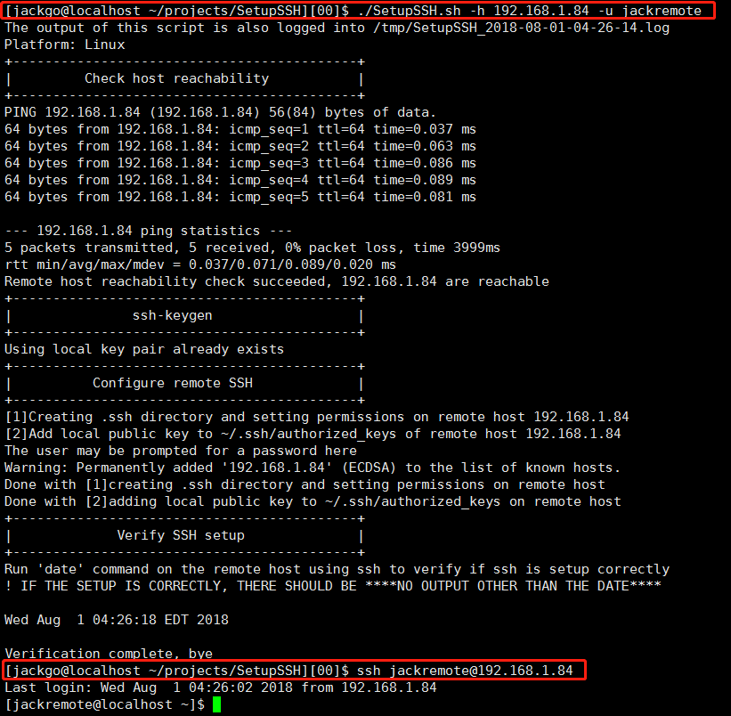

# SetupSSH
This script is used to configure SSH connectivity. After this script runs successfully,  the user can use SSH to run commands on the remote host or copy files between the local host and the remote host **without** being prompted for passwords.



## Usage

```shell
./SetupSSH.sh --help
```

```shell
Options:
  -h, --host          remote host name
  -u, --user          remote user name
  -l, --logfile       location of logfile, default: /tmp/SetupSSH_date.log  
  -p, --port          ssh port, default: 22
  -n, --newlocalpair  remove the old local key files existing and create new ones
      --passphrase    password is required when create new key

Example:
  ./SetupSSH.sh -h 192.168.1.100 -u jackremote
  ./SetupSSH.sh -h 192.168.1.100 -u jackremote --newlocalpair
  ./SetupSSH.sh -h 192.168.1.100 -u jackremote -n --passphrase
  ./SetupSSH.sh -h 192.168.1.100 -u jackremote -p 22
```


## Feedback

Do not hesitate to post your issues, questions and new ideas at the [issues](https://github.com/mutex73/psqlplus/issues) page.

## Authors

Gaomingjie <jackgo73(at)outlook.com> ?., China


---

[something for dev](dev.md)